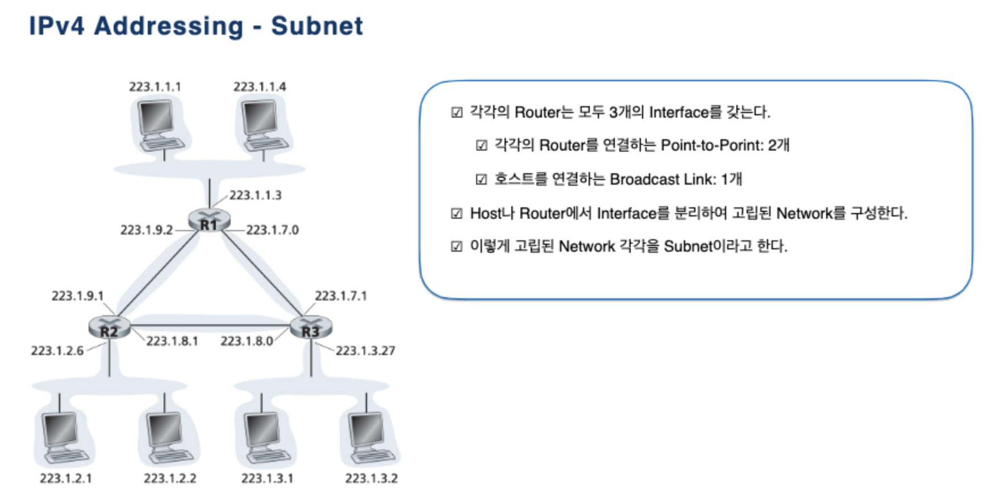
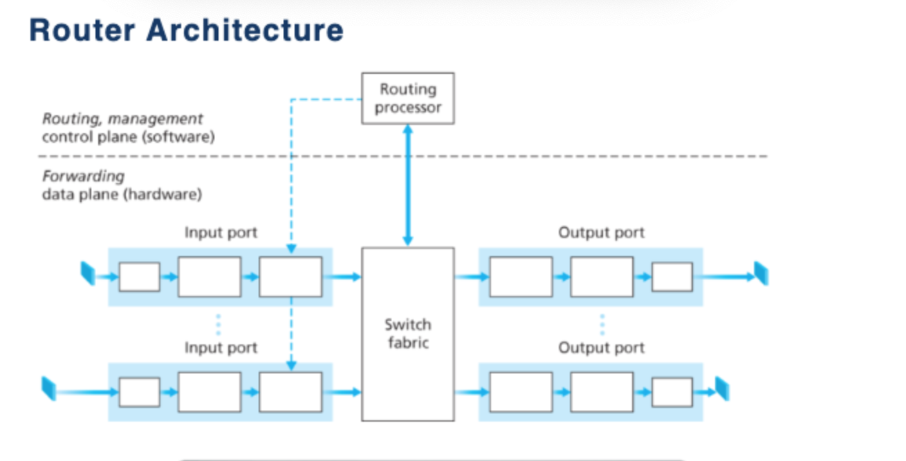
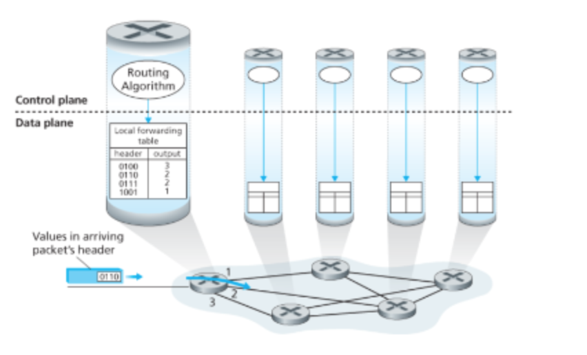
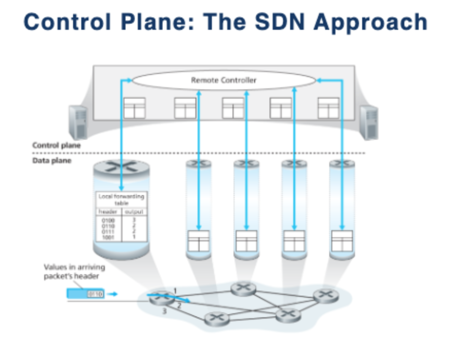

# Network Programming Theory ( ~ middle)
## 전송계층, 네트워크 계층 그리고 Logical communication
> Transport Layer 에서는 서로 다른 Host 에서 동작하는 Process 간의 logical communication 제공.
> 
> Network Layer 에서는 서로 다른 Host 끼리의 logical communication 제공.

### logical communication 
> logical communication이란 서로 통신하는 프로세스들이 물리적으로 / 직접적으로 연결이 되어 있지는 않지만,(그 사이의 많은 라우터들이 있지만) 
> 가까히 연결된 것과 같이 만드는 것.
> 
> 즉, 프로세스 관점에서 마치 그들이 물리적으로 연결되 있는 것처럼 느끼게 한다는 것입니다.

## OSI ,TCP/IP 모델 차이
> OSI 계층 모델은 모든 시스템에서의 통신이 가능하게 하기 위하여 개발된 네트워크 아키텍처.
> [컴퓨터 마다 독자적인 네트워크 구조를 가지고 있으면, 다른 구조를 가지고 있는 네트워크와 통신 불가능] => 표준을 정하자!
>
> TCP/IP 모델은 미국 국방부(DoD)에서 정의한 네트워크 통신 표준 모델이다. 
> 
> OSI 모형이 아니라 TCP/IP가 산업 표준인 이유는 TCP/IP가 OSI보다 더 먼저 사용되었기 때문이다.

> TCP/IP와 OSI는 네트워크 통신 모델의 표준이라는 공통점이 있다. 
> 
> 이들의 가장 큰 차이는, TCP/IP는 OSI의 상위 레이어와 하위 레이어를 통합해서 더 간단하게 표현했다는 것이다.

## segment, datagram
- segment : TCP 에서의 PDU
- datagram : UDP 에서의 PDU
- PDU : Protocol Data Unit

## UDP, TCP
- UDP
> Multiplex, Demultiplex
> 
> 오류 검출 (Checksum Header)
> 
> Traffic 제어 불가능 (Application 이 허용하는 한에서 어떤한 속도라도 가능)

-TCP 
> 흐름제어 [통신 컨트롤 (라우터가 받을 수 있을 만큼만 데이터 넘겨준다. 데이터 양 조절)]
> 혼잡제어 [송신측 TCP 가 트래픽 조절]
> 순서번호
> 확인응답
> 타이머

## Multiplex, Demultiplex 
멀티플렉싱은 주로 sender에서 일어나고 디멀티플렉싱은 주로 receiver에서 일어남.
- Multiplex
> transport layer 정보를 network layer와 physical layer에 담아서 보내는 게 multiplexing
> 올바른 소켓으로 전달.

- Demultiplex
> transport layer 에서 Port 같은 정보를 확인하고 프로세스에 넘겨주는데 demultiplexing.

**각각의 포트번호는 16비트**

## 에러 디텍션 이나 신뢰성 을 보충하기 위한 것들 이런걸 왜하는지, 어떻게 하는지 .
### ARQ (Automatic Repeat reQuest Protocol)
> 재전송을 기반으로 신뢰성 있는 Data 전송을 가능하게 하는 Protocol.

ARQ 를 위한 3가지의 기능 
- Error Detection
- Receiver Feedback
- Re-transmission

## 패킷 손상 어떻게 할거냐.

## Tcp connection 에 대해. (프로세스 끼리 약속하는 커넥션)
Client -> Server (SYN)  
Server -> Client (SYN, ACK)  
Client -> Server (ACK)
## 엔디안

## tcp 고백엔 같이 뭐가 잘못되었고 이런 방법 있다 이런느낌
## 오류 어떻게 디택 할거나 어떻게 해결할거냐
## 데이터그램 포맷 보면서 대충 어떻게 들어갈지 좀 생각하면 될듯
## 필드들이 왜 필요한지 이런걸 알아야됨
## 체크섬 계산

## IP Datagram Fragmentation
> MTU(Maximum Transmission Unit) : 받아 들일수 있는 최대 데이터 패킷 크기.

**MTU 가 넘어가는 데이터 패킷을 보내기 위해서 Fragmentation 과정이 필요.** 

- 라우터는 서로 다른 MTU 를 가진 LinkLayerProtocol 을 사용. (라우터마다 다를 수 있음)
- 한 Link 에서 IP 데이터그램을 사용한 경우, OutGoingLink 를 정해야 하므로 **Forwarding Table** 참조.
- MTU 보다 보내려는 데이터그램이 클 경우 쪼개서 보낸뒤 LinkLayer에서 캡슐화.
- 쪼개진 각각의 Datagram 을 Fragment 라고 한다.
- 쪼개진 Datagram 은 EndSystem 에서 재결합.

### Fragmentation 을 위해 추가된 Header 정보
1. Identification : 어떤 Datagram이 Fragment인지 확인 하기 위한 필드. [id = 777]
2. Flags : IP는 신뢰할수없는서비스를 제공하므로 마지막 Fragment를 수신했는지 확인하기위해 Flag bit를 사용. [마지막일경우 0]
3. Fragment offset : Fragment의 분실여부를 판단하거나 적절한순서로 Fragment를 재결합 하기위해서 사용. [offset = 0]

## Subnet 과 Subnet Mask
### Subnet
> 하나의 라우터 인터페이스로 연결되어 있는 고립된 네트워크.

### Subnetting
- 기존 Class 기반 IP 주소를 관리하다 보니, 낭비되는 IP 주소 발생.
- 이를 막기위해, HOST ID 를 SubnetID 와 HostID 로 세분화 하여, 하나의 큰 네트워크를 여러개의 작은 네트워크로 논리적으로 쪼개서 사용할 수 있다. 

## 라우터 

### Input port
1. Physical layer, Link layer 기능을 수행한다.
2. **Look up 기능을 수행한다.**

> Forwarding Table 을 참조하여 Output port 결정.
> 
> Control Packet 은 Input port 에서 RoutingProcessor 로 전달.

### Switch fabric
1. input 과 output 을 연결하는 역할.

### Output port
1. Switch fabric 에서 수신한 패킷을 저장하고, 
2. physical , link layer 의 역할을 한 뒤,
3. Output port 로 Packet 전송.

### RoutingProcessor
- Control Plane 기능 수행.
1. Traditional Router

> Routing Table 과 연결된 링크 정보를 유지하고 관리하여, Router 의 포워딩 테이블 계산.
2. SDN Router

> Router Processor 는 Remote Controller 와 통신 하여, Remote Controller 에서 계산된 Forwarding Table을 수신.
>
> Router Input Port에 Forwarding Table 항목을 설치한다.

## forwarding 방식
## Routing Table

## 스트림 구조