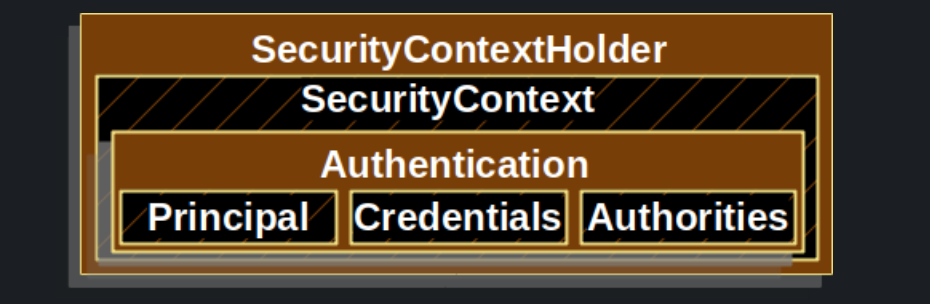
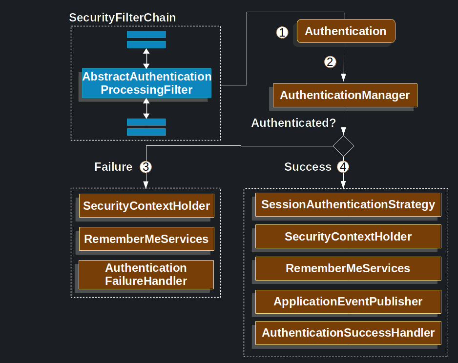

#Authentication (인증)

## Servlet Authentication Architecture
### SecurityContextHolder

>SecurityContextHolder 는 Spring Security 가 인증된 사람의 세부 정보를 저장하는 곳입니다.
> 
>Spring Security는 SecurityContextHolder가 어떻게 채워지는지 신경 쓰지 않습니다. 값이 포함되어 있으면 현재 인증된 사용자로 사용됩니다.

>The simplest way to indicate a user is authenticated is to set the SecurityContextHolder directly.

####Setting SecurityContextHolder
~~~
//create a new SecurityContext instance instead of using SecurityContextHolder.getContext().setAuthentication(authentication) to avoid race conditions across multiple threads
SecurityContext context = SecurityContextHolder.createEmptyContext(); 

//Spring Security does not care what type of Authentication implementation 
//ex) UsernamePasswordAuthenticationToken
Authentication authentication = new TestingAuthenticationToken("username", "password", "ROLE_USER"); 

context.setAuthentication(authentication);

//Spring Security will use this information for authorization.
SecurityContextHolder.setContext(context); 
~~~

#### Access Currently Authenticated User
~~~
SecurityContext context = SecurityContextHolder.getContext();
Authentication authentication = context.getAuthentication();
String username = authentication.getName();
Object principal = authentication.getPrincipal();
Collection<? extends GrantedAuthority> authorities = authentication.getAuthorities();
~~~

####잘 이해 안가는 부분.
>By default the SecurityContextHolder uses a ThreadLocal to store these details, 
> which means that the SecurityContext is always available to methods in the same thread, 
> even if the SecurityContext is not explicitly passed around as an argument to those methods. 
> 
>Using a ThreadLocal in this way is quite safe if care is taken to clear the thread after the present principal’s request is processed. 
> **Spring Security’s FilterChainProxy ensures that the SecurityContext is always cleared.**

### SecurityContext
> SecurityContextHolder 에서 가져 올 수 있다. 
> 
> The SecurityContext contains an Authentication object.

###Authentication 객체
>The Authentication serves two main purposes within Spring Security
1. An input to AuthenticationManager to provide the credentials a user has provided to authenticate.  ->  isAuthenticated() returns false.
2. Represents the currently authenticated user. The current Authentication can be obtained from the SecurityContext.

#### 구성
- principal : 사용자를 식별 하는 객체.
> Ex) UserDetails 의 인스턴스. 
- credentials : 유출 방지를 위해 대부분의 경우 인증 한뒤 credential 부분 삭제.
> Ex) password
- authorities : 해당 객체에 부여된 권한 
> Ex) GrantedAuthority

### GrantedAuthority : 부여된 권한 객체.
> Authentication.getAuthorities() 메서드에서 얻을 수 있다.
> 
> Collection type 의 GrantedAuthority 를 제공한다.

>사용자 이름/비밀번호 기반 인증을 사용할 때 GrantedAuthoritys는 일반적으로 UserDetailsService에 의해 로드됩니다.

#### 왜 Collection Type 으로 제공할까?
> 내 생각에는 권한을 여러개 갖고 있을 수 있기 때문인것 같다. 
> 
> Ex) USER, ADMIN, TEAM_LEADER, TEAM_MEMBER 의 Role 이 있을 때 USER 이면서 LEADER 일 수 있기 때문에.

##AuthenticationManager
>AuthenticationManager는 Spring Security's filter 가 인증을 수행하는 방법을 정의하는 API 입니다.
> 
> Spring Security의 Filters 가 호출한 Authentication 객체는 AuthenticationManager 에 의해 인증을 수행하고 , 성공 하게 되면 SecurityContextHolder 에 setting 된다. 

>**Spring Security의 Filters와 통합하지 않는 경우 SecurityContextHolder를 직접 설정할 수 있으며 AuthenticationManager를 사용할 필요가 없습니다.**

>가장 많이 사용되는 구현체는 ProviderManager.

##ProviderManager
> ProviderManager 는 AuthenticationProviders 에 위임
> 
> 여러 AuthenticationProvider 를 ProviderManager에 주입할 수 있습니다.

- 하나의 AuthenticationProvider 는 특정 유형의 인증을 수행하는 방법을 알고 있다. 
>Ex) Id, Password 유효성 검사 , 토큰 signature 유효성 검사, 토큰 시간 만료 확인 등.
- AuthenticationProvider 는 여러 유형의 인증을 지원하고 단일 AuthenticationManager 빈만 노출하면서 매우 특정한 유형의 인증을 수행할 수 있습니다.

##Request Credentials with AuthenticationEntryPoint
>AuthenticationEntryPoint is used to send an HTTP response that requests credentials from a client.
> 
> 인증이 필요한 요청에 인증 되지 않은 요청을 할 경우. 예를 들어 비로그인 상태로 로그인 해야 볼 수 있는 기능을 사용하려 할 경우 해당 구현체로 처리.
> 
> > ex) 로그인 페이지로 리디렉션을 수행 등

##AbstractAuthenticationProcessingFilter

>AbstractAuthenticationProcessingFilter는 사용자의 자격 증명을 인증하기 위한 기본 필터로 사용됩니다.

>자격 증명이 인증되기 전에 Spring Security는 일반적으로 AuthenticationEntryPoint를 사용하여 자격 증명을 요청합니다.
> 

1. the AbstractAuthenticationProcessingFilter creates an Authentication from the HttpServletRequest to be authenticated.
>The type of Authentication created depends on the subclass of AbstractAuthenticationProcessingFilter. 
> 
> UsernamePasswordAuthenticationFilter creates a UsernamePasswordAuthenticationToken

2. Authentication is passed into the AuthenticationManager to be authenticated.
3. If fail
> The SecurityContextHolder is cleared out.
>
> AuthenticationFailureHandler is invoked
4. If Success
> Authentication set on the SecurityContextHolder. 나중에 SecurityContextPersistenceFilter는 SecurityContext를 HttpSession에 저장합니다.
> 
> SessionAuthenticationStrategy is notified of a new login.
> 
> AuthenticationSuccessHandler is invoked.

###https://catsbi.oopy.io/f9b0d83c-4775-47da-9c81-2261851fe0d0 잘 이해 안감.
>사용자 별 Authentication 인증 객체를 어떻게 구분하는가?
위 그림에서도 나와있듯이 SecurityContextHolder라는 전역 객체 안에 SecurityContext에 인증 객체를 저장하는데, 이 SecurityContextHolder는 ThreadLocal에 저장되기 때문에 각기 다른 쓰레드별로 다른 SecurityContextHolder 인스턴스를 가지고 있어서 사용자 별로 각기 다른 인증 객체를 가질 수 있다. 

##UserDetails
>Spring Security에서 사용자의 정보를 담는 인터페이스이다.
> 
Spring Security에서 사용자의 정보를 불러오기 위해서 구현해야 하는 인터페이스로 기본 오버라이드 메서드들은 아래와 같다.

## UserDetailsService
> Spring Security에서 유저의 정보를 가져오는 인터페이스이다.
> 
> loadUserByUsername 메서드 : 유저의 정보를 불러와서 UserDetails return.
> 

