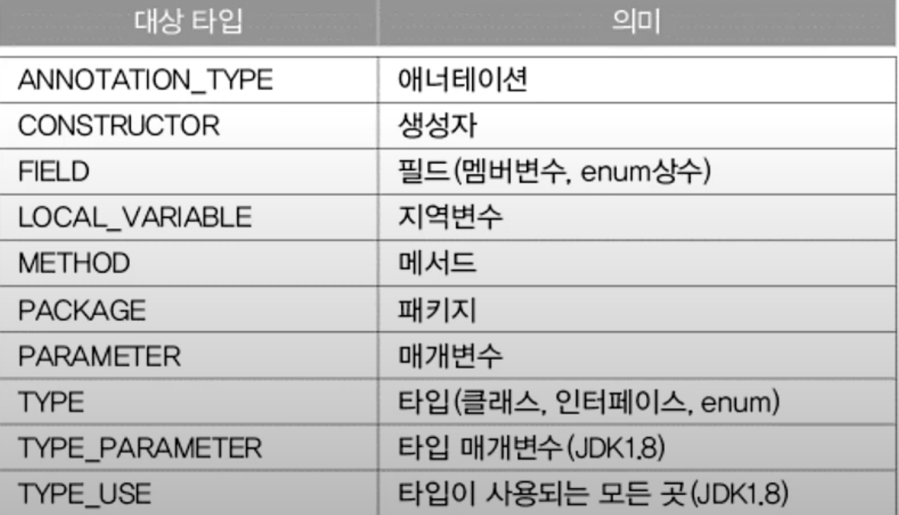

#annotation

##탄생 배경
- 코드와 문서를 같이 관리 하기 쉽지 않음.
> 버전 불일치 문제
- 코드와 문서를 같이 관리 할 수 있는 걸 만들어보자.
- 유용한 정보를 제공 하고, 주석처럼 프로그래밍 언어에 영향을 미치지 않는다.

##표준 애너테이션
- 자바에서 제공하는 애너테이션 (@Override, @FuctionalInterface 등)
##메타 애너테이션
- 애너테이션을 만들때 사용.

###@Target
>애너테이션 적용대상 지정
1. TYPE : Class 나 Interface 
2. FIELD : 멤버 변수
...

###Retention
>애너테이션이 유지 되는 기간을 지정
1. SOURCE : 소스 파일에만 존재. 클래스 파일 존재 X. 
>컴파일러에 의해 사용되는 것들은 다 SOURCE
2. RUNTIME : 클래스 파일에 존재, 실행시에 사용가능.
3. CLASS : 컴파일러가 클래스 참조 할때까지만 유효.

###@Documented, @Inherited
>javadoc 으로 작성한 문서에 포함 :: @Documented

>@Inherited 를 이용하여 애너테이션 상속 하게 할 수 있다.
~~~
@Inherited
@Interface MyAnnotation{}

@MyAnnotation
class parent{}

class Child extend Parent{}
~~~

###@Repeatable
~~~
@Repeatable
@interface toDo{ String value();}

@toDo("밥먹기")
@toDo("개발하기")
class TodayList{}

//필수적으로 정의해야 한다.
@interface toDos{
    toDo[] value();
}
~~~

