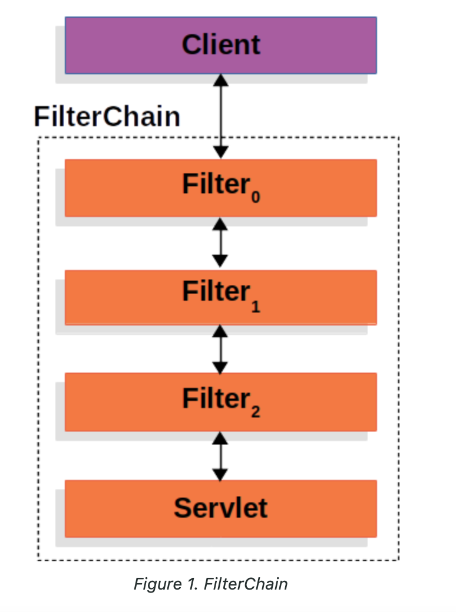
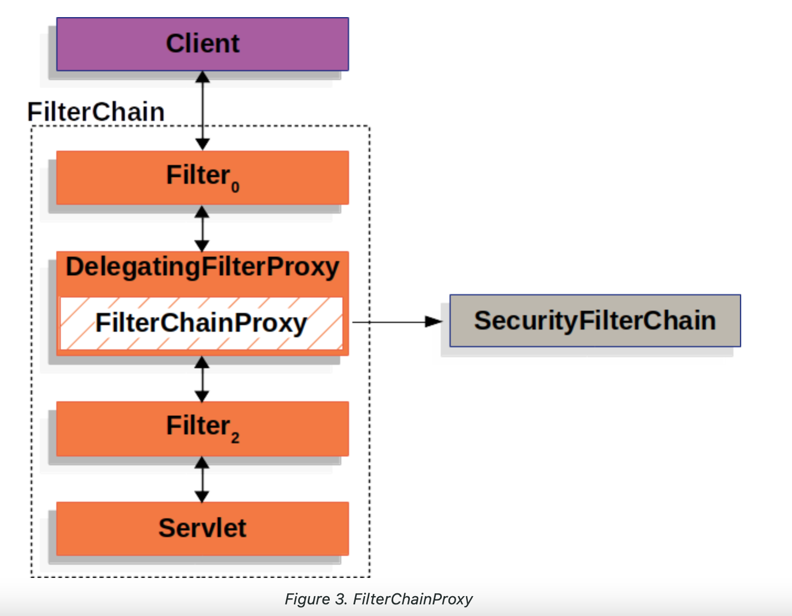
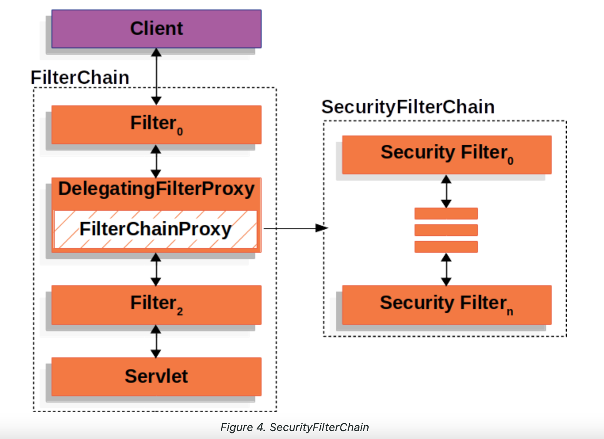

### 참고 레퍼런스
https://docs.spring.io/spring-security/reference/servlet/architecture.html

## Spring Security 란
> Spring Security is a framework that provides authentication, authorization, and protection against common attacks.
>
> Spring Security’s Servlet support is based on Servlet Filters.

> 목적 : 자바 어플리케이션에서 authentication, authorization 증 기능을 제공 하는데에 중점을 둔 프레임워크.
## Spring Security 아키텍처

### FilterChain

클라이언트 request 시 ->
> 요청 URI 기반으로 HttpServletRequest 를 처리해야 하는 필터(여러개 가능)와 서블릿(단일 디스패쳐서블릿 인스턴스)이 포함된 **FilterChain** 생성.
>

#### FilterChain Usage Example
~~~
public void doFilter(ServletRequest request, ServletResponse response, FilterChain chain) {
	// do something before the rest of the application
    chain.doFilter(request, response); // invoke the rest of the application
    // do something after the rest of the application
}
~~~

### DelegatingFilterProxy (delegate : 대리자)

>Spring provides a Filter implementation named DelegatingFilterProxy that allows bridging between the Servlet container’s lifecycle and Spring’s ApplicationContext.
>
> 서블릿 컨테이너는 자체 표준으로 Filter 를 등록 할 수 는 있지만, Spring 에서 정의한 빈을 인식 하지 못한다.
> 
>DelegatingFilterProxy는 표준 서블릿 컨테이너 메커니즘을 통해 등록할 수 있지만, 모든 작업을 Filter를 구현하는 Spring Bean에 위임합니다.
> 
> DelegatingFilterProxy는 ApplicationContext에서 Bean "정지원 필터 빈" 을 찾은 다음 Bean "정지원 필터 빈"을 호출합니다.
> 
>>서블릿 컨테이너와 스프링 컨테이너(어플리케이션 컨텍스트) 사이의 링크를 제공하는 ServletFilter이다. 특정한 이름을 가진 스프링 빈을 찾아 그 빈에게 요청을 위임한다.

~~~
public void doFilter(ServletRequest request, ServletResponse response, FilterChain chain) {
	// Lazily get Filter that was registered as a Spring Bean
	// For the example in DelegatingFilterProxy 
delegate
 is an instance of Bean Filter0
	Filter delegate = getFilterBean(someBeanName);
	// delegate work to the Spring Bean
	delegate.doFilter(request, response);
}
~~~

### FilterChainProxy (Spring Security 제공)

>Spring Security’s Servlet support is contained within FilterChainProxy.
> 
> allows delegating to many Filter instances through SecurityFilterChain
> 
> 즉, SecurityFilterChain 을 통해 많은 filter 인스턴스에게 위임 할 수 있게 해준다.
> 
> Since FilterChainProxy is a Bean, it is typically wrapped in a DelegatingFilterProxy.
> 
#### 장점
 - Servlet Container 또는 DelegatingFilterProxy 에 직접 등록 할 때 (Bean) 이점을 준다. 
    - First, it provides a starting point for all of Spring Security’s Servlet support. 
   >이를 통해 수월한 디버그가 가능하다.
    - FilterChainProxy는 Spring Security 사용의 핵심이기 때문에 선택 사항으로 보이지 않는 작업을 수행할 수 있습니다.
   >메모리 누수를 피하기 위해 SecurityContext를 지운다던지,  특정 유형의 공격으로부터 애플리케이션을 보호하는 HttpFirewall 을 적용시킨다던지 등등..,
   - SecurityFilterChain을 호출해야 하는 시기를 결정할 때 더 많은 유연성을 제공합니다.
   >서블릿 컨테이너에서 필터는 URL만을 기반으로 호출됩니다. 
   > 
   >그러나 FilterChainProxy는 RequestMatcher 인터페이스를 활용하여 HttpServletRequest의 모든 항목을 기반으로 호출을 결정할 수 있습니다.
   >
   >실제로 FilterChainProxy를 사용하여 어떤 SecurityFilterChain을 사용해야 하는지 결정할 수 있습니다.

### SecurityFilterChain (Spring Security 제공)

>SecurityFilterChain is used by FilterChainProxy to determine which Spring Security Filters should be invoked for this request.
> 
> (FilterChainProxy 요청에 대해 호출해야 하는 Spring Security Filter 를 결정하는데 사용된다.)
> 
> The Security Filters in SecurityFilterChain are typically Beans, but they are registered with FilterChainProxy instead of DelegatingFilterProxy.
> 
> (Security Filters 들은 FilterChainProxy 에 등록된다.)

**다중 SecurityFilterChain 그림에서 FilterChainProxy는 사용해야 하는 SecurityFilterChain을 결정. 그안의 여러 Filters 타면서 실행**

>Only the first SecurityFilterChain that matches will be invoked

>Assuming that no other, SecurityFilterChain instances match SecurityFilterChainn will be invoked.

>각 SecurityFilterChain은 고유하고 격리되어 구성될 수 있습니다.
> 
>실제로 애플리케이션이 Spring Security가 특정 요청을 무시하기를 원하는 경우 SecurityFilterChain은 보안 필터가 0일 수 있습니다.

### Security Filters

>SecurityFilterChain API 에 의해 FilterChainProxy 에 삽입된다. 
>
> 순서가 존재.

####순서 참조 레퍼런스
https://docs.spring.io/spring-security/reference/servlet/architecture.html 

## Handling Security Exceptions

> ExceptionTranslationFilter를 사용하면 AccessDeniedException 및 AuthenticationException을 HTTP 응답으로 변환할 수 있습니다. (거의 맨 마지막에 실행)
> 
> ExceptionTranslationFilter is inserted into the FilterChainProxy as one of the Security Filters.

### Handle 과정
1. FilterChain.doFilter(request, response)를 호출하여 나머지 애플리케이션을 호출합니다.
2. If the user is not authenticated or it is an AuthenticationException, then Start Authentication.
 - The SecurityContextHolder is cleared out (SecurityContextHolder 지우기)
 - HttpServletRequest는 RequestCache에 저장됩니다. (추후 사용자 성공적으로 인증시 RequestCache를 사용하여 원래 요청을 재개)
 -AuthenticationEntryPoint는 클라이언트에서 자격 증명을 요청하는 데 사용됩니다. 예를 들어 로그인 페이지로 리디렉션하거나 WWW-Authenticate 헤더를 보낼 수 있습니다.
3. Otherwise if it is an AccessDeniedException, AccessDeniedHandler is invoked to handle access denied.

>If the application does not throw an AccessDeniedException or an AuthenticationException, then ExceptionTranslationFilter does not do anything.

~~~
try {
	filterChain.doFilter(request, response); 
} catch (AccessDeniedException | AuthenticationException ex) {
	if (!authenticated || ex instanceof AuthenticationException) {
		startAuthentication(); 
	} else {
		accessDenied(); 
	}
}
~~~
> If another part of the application, (i.e. FilterSecurityInterceptor or method security) throws an AuthenticationException or AccessDeniedException it will be caught and handled here.
> 
> If the user is not authenticated or it is an AuthenticationException, then Start Authentication.
>
> Otherwise, Access Denied
