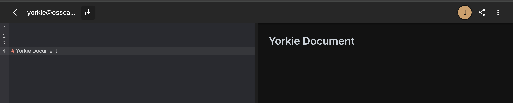
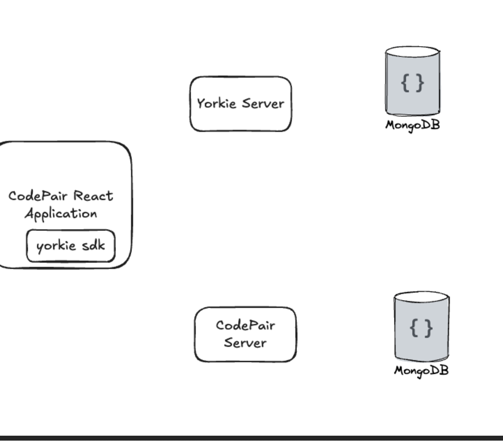

# CodePair And Yorkie

## Reference 

[reference link](https://github.com/yorkie-team/codepair/issues/373)

## Pictures

## Feature Used 

1. Activate Client
2. Attach Document
3. Watch Document
4. Push Pull

## Activate Client

> Project 전반에서 사용되는 Client 를 등록하기 위한 API. 

~~~ 
type ActivateClientRequest struct {
	state         protoimpl.MessageState
	sizeCache     protoimpl.SizeCache
	unknownFields protoimpl.UnknownFields

	ClientKey string            `protobuf:"bytes,1,opt,name=client_key,json=clientKey,proto3" json:"client_key,omitempty"`
	Metadata  map[string]string `protobuf:"bytes,2,rep,name=metadata,proto3" json:"metadata,omitempty" protobuf_key:"bytes,1,opt,name=key,proto3" protobuf_val:"bytes,2,opt,name=value,proto3"`
}

type ActivateClientResponse struct {
state         protoimpl.MessageState
sizeCache     protoimpl.SizeCache
unknownFields protoimpl.UnknownFields

	ClientId string `protobuf:"bytes,1,opt,name=client_id,json=clientId,proto3" json:"client_id,omitempty"`
}
~~~

- Client Application 에서 생성한 Client Key 기반으로 요청.
- Yorkie 서버에서 Key 기반으로 클라이언트를 Upsert 하여, 서버에서 관리하는 Client ID 반환.
- Project ID 와 Client Key 기반으로 찾고, Upsert 수행.

### Issue 
- Code Pair 서버에서 Client Key 를 관리하고 있지않아서, Client Key 가 매번 생성되고 있는 Issue.

## Attach Document

> Client 가 어떤 Document 에게 붙어서 편집을 진행할 것인지 등록하는 API.

## Watch Document
- Client 를 In-Memory Pub/Sub 에 등록을 하고, Document 에서 발생되는 이벤트를 Stream 을 통해 다른 클라이언트들에게도 전파.

## Push Pull

- 연관 개념 [checkpoint](checkpoint.md)

## Flow 

- 'A' 라는 Code Pair Client Application 에서 "HI" 라는 문구를 추가 했을 때, H(C1), I(C2) 들이 각각의 Push Change 로 Yorkie 서버  
  로 Push 요청 
- Yorkie 서버에서는 도큐먼트의 변경에 대한 Push 와 'A' 에서 Pull 해와야 할 변경 사항들을 Pull 해온다.
- Yorkie 서버에서는 해당 도큐먼트를 Attach 하고 있는 다른 클라이언트들에게 "도큐먼트 변경" 이라는 Trigger 이벤트를 발행한다.
- 해당 도큐먼트를 Attach 하고 있는 다른 클라이언트들은 "도큐먼트 변경" 이벤트를 컨슘하여, Push Pull 요청을 Yorkie 서버에 요청한다.
> 다른 클라이언트를 'B' 라고 하며, "NO" 라는 Push Change 가 존재한다고 가정한다.
- Yorkie 서버에서는 도큐먼트의 변경에 대한 Push 와 해당 도큐먼트를 Attach 하고 있는 다른 클라이언트들 각각 Pull 해와야 할 변경 사항들을 Pull 해온다.
> B 클라이언트에서는 "HI" 를 Pull 해온다.
- 변경사항이 존재한다면 다른 클라이언트들에게 "도큐먼트 변경" 이라는 Trigger 이벤트를 발행한다.
> A 클라이언트에서는 "NO" Pull 해온다.

----
#### Attach

- 여기서 새로운 Client 가 붙게 될 경우, 변경에 대한 Pull 이벤트(Change) 들의 양(크기)이 일정 임계치를 넘게 될 경우 가장 최근의 SnapShot 들과
  그 이후의 Change 들만 보내는 방식을 통해 부하를 관리한다.

----
#### Detach

- 기존의 Client 들은 Detach, DeActivate 수행. 
- 필요없는 메모리들을 정리. 

### 순서의 문제 
A,B 모두 변경사항들은 Pull 해왔지만, 순서의 문제가 존재한다. 

> A : "HI NO"    B : "NO HI"

### 해결 
- Push Change 들에 대해서, 순서를 알 수 있는 ID 부여를 통해 일관성을 맞출수 있다.
- CRDT 자료구조를 통해 이를 관리.

### Remove 시 문제 
- Remove 시, Hard Delete 를 하게 되면 CRDT 특성 상 해당 엘리먼트를 참조하고 있는 엘리먼트가 존재할 수 있어서 문제가 발생한다.
- 이를 해결하기 위해, Soft Delete 를 통해 Viewing 하지는 않지만 데이터 상에는 남아있도록 해결.

- 하지만, 이런 방식은 데이터가 계속 쌓여 메모리의 문제로 이어질 수 있다.
- 이를 Garbage Collection 을 통해 지워서 해결한다. Design 문서에 설명되어있음.
[설계 디자인 문서](https://miro.com/app/board/o9J_kidjCtk=/) , pullPack 메서드 참조.

## Authenticate

### Project Level
- http header 'x-api-key' 의 project key 를 넣어 요청.

### Document Level
- client 가 yorkie server 의 Document 와 Attach 될 때, yorkie server 는 Code Pair 서버에게 해당 유저가 도큐먼트에 접근 할 수 있는 유저인지
  확인한다.

> Authenticate 는 In-memory cache 를 이용하여 잦은 요청을 효율적으로 처리할 수 있게 한다.

## How Code Pair Receive Yorkie Server Data

Yorkie 서버에서 Code Pair 서버에게 변경 Web Hook 을 보낸다. 

### Problem
- Too many Request. 문서 편집 어플리케이션 특성상 수많은 편집 또는 변경 Hook 이 발생.

### Solve
- Throttling and Debouncing 를 통해 해결.

## How to Scale Yorkie 

[sharded_cluster_mode](sharded_cluster_mode.md)

  

